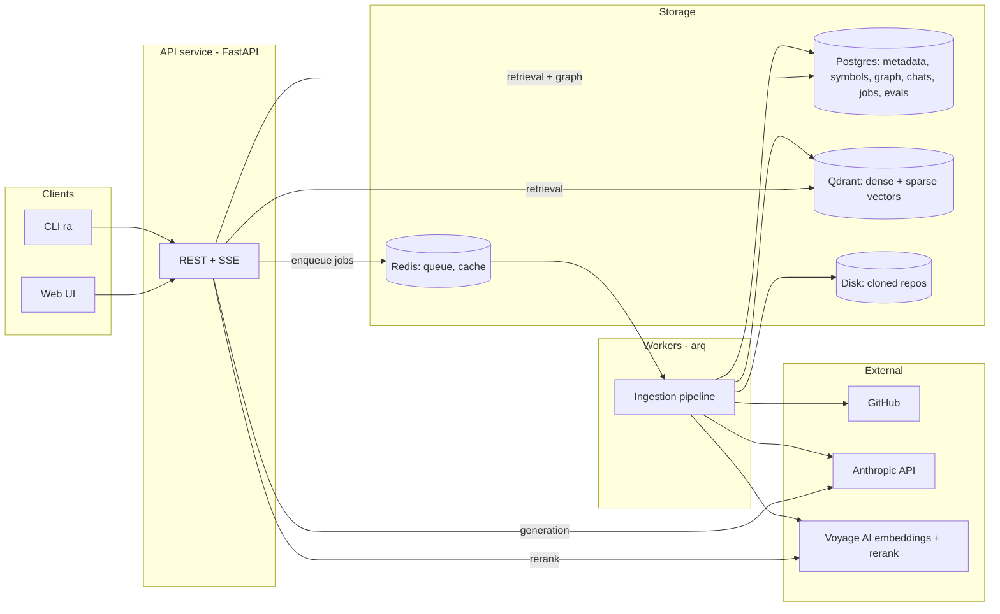

# Architecture

> Status: **v1 design (2026-07)** — authoritative for Phases 0–5. Cross-references: [ROADMAP.md](ROADMAP.md) for sequencing, [adr/](adr/README.md) for decision rationale.

## 1. Goals and non-goals

**Goals**

- Deep, structured understanding of arbitrary repositories (any size, language mix, structure) — not file-grep with an LLM on top.
- Source-grounded answers: every claim traceable to `file:line-range` at a pinned commit, with citations verified before display.
- Cross-file reasoning: architecture questions, execution tracing, dependency questions.
- Production posture: incremental indexing, observability, evaluation gates in CI, security against untrusted repo content.
- Extensibility: new languages, new retrieval channels, new capabilities (PR review, doc generation) without redesign.

**Non-goals (v1)**

- Executing repository code (static analysis only — security boundary).
- Editing repositories (read/answer only; write capabilities are a later extension).
- Compiler-grade symbol resolution (heuristic resolution with a documented upgrade path — [ADR-0005](adr/0005-code-graph.md)).

## 2. System overview



Two runtime processes share one library:

- **API service** (FastAPI): repo registration, chat with SSE streaming, search endpoints, job status.
- **Worker** (arq): ingestion/indexing jobs, summary generation, incremental updates.

Everything of substance lives in the `repo_assistant` Python package; API, worker, and CLI are thin shells. This keeps every pipeline runnable and testable without infrastructure ([ADR-0001](adr/0001-language-and-stack.md)).

## 3. Repository layout and module responsibilities

```
repo_assistant/
├── src/repo_assistant/
│   ├── core/          # config (pydantic-settings), logging, errors, token counting,
│   │                  # provider interfaces: LLMClient, Embedder, Reranker, VectorIndex; test fakes
│   ├── providers/     # vendor adapters implementing core interfaces (voyage-code-3,
│   │                  # Anthropic) + a settings-driven factory — the only place SDKs are imported
│   ├── ingestion/     # git acquisition (clone/fetch/diff), file scanning + filtering,
│   │                  # language detection, secret redaction
│   ├── parsing/       # tree-sitter parsing, symbol + import extraction, docstrings
│   ├── chunking/      # AST-aware code chunker, markdown/config chunkers, fallback chunker
│   ├── graph/         # code graph construction (name resolution heuristics) + traversal API
│   ├── enrichment/    # contextual chunk descriptions, file/dir/repo summaries, repo map
│   ├── indexing/      # embedding batches + cache, Qdrant/Postgres writers,
│   │                  # incremental update planner (diff → work items)
│   ├── retrieval/     # query understanding, hybrid search channels, RRF fusion,
│   │                  # reranking, context assembly + token budgeting
│   ├── reasoning/     # intent router, fast-path RAG, agentic loop + tools,
│   │                  # citation extraction + verification, conversation memory
│   ├── storage/       # SQLAlchemy models + repositories, Alembic migrations,
│   │                  # Qdrant client wrapper, Redis cache helpers
│   ├── api/           # FastAPI app: routers, request/response schemas, SSE, auth middleware
│   ├── workers/       # arq task definitions (thin wrappers over pipeline stages)
│   └── cli/           # typer CLI (`ra index <url>`, `ra chat <repo>`, `ra eval ...`)
├── tests/             # unit + integration (testcontainers for Qdrant/Postgres/Redis)
├── evals/             # golden datasets, synthetic generation, judges, reports
├── infra/             # docker-compose.yml, Dockerfiles, deployment docs
├── docs/              # this documentation
└── frontend/          # Next.js chat UI (Phase 4)
```

Dependency rule: `api`/`workers`/`cli` → pipelines (`ingestion`…`reasoning`) → `storage`/`core`. Pipeline modules never import vendor SDKs directly; they use the interfaces in `core/`.

## 4. Ingestion pipeline

State machine per repo snapshot: `PENDING → CLONING → SCANNING → PARSING → EMBEDDING → INDEXING → ENRICHING → READY | FAILED`, with per-stage progress persisted (resumable — [ADR-0008](adr/0008-job-queue.md)).

1. **Acquire** — `git clone` (blobless partial clone `--filter=blob:none`, then checkout target ref); record commit SHA. Updates: `git fetch` + `git diff --name-status <indexed>..<new>`.
2. **Scan** — walk the tree honoring `.gitignore` plus our exclusion policy: binaries, vendored/generated dirs (`node_modules`, `dist`, minified files, lockfiles), files > 1 MB, high-entropy secret candidates (redacted, never indexed). Language detection by extension + available tree-sitter grammar.
3. **Parse** — tree-sitter → AST per file; extract symbols (functions, classes, methods, top-level constants), signatures, docstrings, spans, imports/exports. Persist to the symbol tables.
4. **Chunk** — AST-aware ([ADR-0002](adr/0002-parsing-and-chunking.md)): chunks are unions of complete AST nodes within a ~1,200-token budget; small siblings merged, oversized bodies split at statement boundaries. Each chunk carries a breadcrumb header (`path › class › signature`) that is embedded with the body but excluded from citation spans. Markdown/config get structure-aware splitters; unsupported languages fall back to line windows (searchable, no symbols).
5. **Embed** — batched calls through the `Embedder` interface with a content-hash cache keyed `(model, dims, sha256(text))`; unchanged chunks never re-embed.
6. **Index** — upsert Qdrant points (dense + sparse named vectors, payload = chunk metadata) and Postgres rows (files, chunks bookkeeping, symbols, edges) transactionally per file batch; on failure a stage retries idempotently.
7. **Enrich** (tiered by repo size and budget) —
   - *Contextual descriptions:* claude-haiku-4-5 generates a 1–2 sentence situating blurb per chunk (whole file passed with prompt caching), prepended before embedding — Anthropic's contextual-retrieval technique, applied where the eval shows lift.
   - *Hierarchical summaries:* file summaries → directory summaries → repo overview.
   - *Repo map:* compact tree of paths + key exported symbols (~500–800 tokens), regenerated on index update; included in every generation prompt and cached via prompt caching.

## 5. Retrieval pipeline

```
query ──▶ understand ──▶ candidate channels (parallel) ──▶ RRF fuse ──▶ (opt-in rerank) ──▶ assemble context
```

1. **Query understanding** — condense the question against conversation history (rewrite follow-ups into standalone queries); extract identifier-like tokens (`CamelCase`, `snake_case`, dotted paths); classify intent (shared with the reasoning router).
2. **Candidate generation** (parallel):
   - *Dense:* semantic search over chunk embeddings.
   - *Sparse:* BM25 sparse vectors in the same Qdrant query (server-side hybrid).
   - *Symbol:* exact + trigram-fuzzy lookup against the Postgres symbol table for extracted identifiers — this channel makes `getUserById`-style queries deterministic.
   - *Graph expansion (opt-in):* when identifiers resolve to symbols, pull 1-hop neighbors (callers/callees/definitions). Measured net-negative in default fusion — hub symbols flood RRF ([ADR-0011](adr/0011-graph-channel-disabled-by-default.md)); the graph serves the agent path's `graph_neighbors` tool instead.
   - Filters: `repo_id` always; optionally `language`, `path prefix`, `kind` (code/doc/config/summary) from query understanding.
3. **Fusion** — Reciprocal Rank Fusion across channels (robust, no score calibration needed). Default channels: dense + sparse + symbol.
4. **Rerank (opt-in)** — cross-encoder behind the `Reranker` interface; measured net-negative for identifier queries and disabled by default ([ADR-0010](adr/0010-reranking-disabled-by-default.md)).
5. **Context assembly** — dedupe overlapping spans; expand chunks to enclosing symbol boundaries; cap per-file share for diversity; order by file then line; prepend repo map + relevant file summaries; fit to the generation token budget with a greedy score-ordered packer.

## 6. Reasoning pipeline

Two tiers behind an intent router ([ADR-0006](adr/0006-reasoning-pipeline.md)):

- **Router** — claude-haiku-4-5 classifies intent (`lookup | explain | architecture | trace | debug | other`) and estimates hop-count. Cheap, logged, evaluated.
- **Fast path** (lookup/explain, single-hop): one retrieval pass → grounded generation. Latency target < 10 s to first token.
- **Agent path** (architecture/trace/debug, multi-hop): claude-opus-4-8 with read-only tools over the **index** (never the live filesystem — snapshot consistency):
  `search_code(query, filters)`, `read_span(path, start, end)`, `get_symbol(name)`, `graph_neighbors(symbol, kind)`, `list_dir(path)`.
  Budget: ≤ 8 tool calls, then a forced final answer. Adaptive thinking on; effort tuned per route.

**Grounding and citations** ([ADR-0007](adr/0007-llm-provider-and-models.md)):

- Retrieved chunks are passed as document content blocks with API-native citations enabled; returned char-offset citations map deterministically back to `path:start_line-end_line@commit`.
- **Post-hoc verification:** every citation is resolved against the index — the span must exist and the cited content must match. Invalid citations are dropped and the claim flagged; answers with zero surviving citations for factual claims are regenerated once, then surfaced with an explicit low-confidence warning.
- The system prompt instructs refusal over invention when retrieval comes back empty ("I could not find this in the repository" is a valid answer and is eval-rewarded).

**Conversation memory** — messages persisted per session (bound to a repo snapshot); short window kept verbatim, older turns rolled into a summary; retrieved-chunk IDs tracked per session so follow-ups prefer cheap re-expansion over fresh retrieval.

**Prompt caching** — stable prefix order: system prompt → repo map → conversation; `cache_control` breakpoints after the repo map and after the last appended turn. The repo map is byte-stable between index updates specifically so the cache holds.

## 7. Data model

**Postgres** (all rows carry `repo_id`; snapshot-scoped rows carry `commit_sha`):

| Table | Purpose |
|---|---|
| `repos` | url, provider, default ref, visibility, status, active snapshot |
| `snapshots` | commit SHA, indexed_at, stats, state-machine status |
| `files` | path, language, size, content_hash |
| `symbols` | name, qualified_name, kind, file, span, signature, docstring, parent symbol |
| `edges` | src/dst (symbol or file), kind (`contains/imports/calls/inherits/references`), confidence |
| `chunks` | chunk_id ↔ Qdrant point, file, span, kind, content_hash |
| `summaries` | scope (`file/dir/repo`), path, content, source_hash (staleness detection) |
| `chat_sessions` / `chat_messages` | session ↔ snapshot binding; messages with citations JSONB, token usage |
| `jobs` | type, stage, state, progress, error, checkpoints |
| `eval_runs` / `eval_results` | see [EVALUATION.md](EVALUATION.md) |

**Qdrant** — single collection, named vectors `dense` (voyage-code-3) + `sparse` (BM25 via Qdrant IDF-modifier sparse vectors, dependency-free code-aware tokenizer); payload: `repo_id` (tenant key, indexed), `path`, `language`, `category`, `symbol`, `start_line`, `end_line`, `commit`, and the chunk `text` itself (so retrieval returns citable content without a second round-trip). Payload-partitioned multitenancy ([ADR-0009](adr/0009-multitenancy-and-versioning.md)); scalar int8 quantization enabled once collections grow. Point IDs are `uuid5(snapshot, path, index)` so re-indexing upserts are idempotent, and equal the `chunks.id` bookkeeping row.

## 8. Incremental indexing and version awareness

- Every indexed artifact is stamped with its commit SHA; answers state the commit they describe. Chat sessions bind to a snapshot at start.
- Update flow: fetch → diff indexed..new → plan work items (deleted → delete points/rows by path; modified/added → re-parse/re-chunk/re-embed those files only; renames from git similarity detection) → apply → refresh summaries whose `source_hash` changed → regenerate directory/repo summaries only when > 20 % of children changed (staleness budget) → atomically advance the active snapshot.
- v1 keeps one active snapshot per repo; the schema (snapshot table + commit-stamped payloads) makes multi-ref/time-travel additive.
- Triggers: manual re-index and polling in Phase 4; GitHub App webhooks in Phase 5.

## 9. Scalability

| Tier | Size | Strategy |
|---|---|---|
| Small | < 1k files | Full index including all enrichment |
| Medium | 1k–20k files | Full code index; contextual descriptions + summaries for high-centrality files only (import-graph PageRank) |
| Large | > 20k files | Prioritized indexing (centrality + recency of change); coarse-to-fine retrieval (repo map → directory summaries → file → chunk); lazy deep-indexing of cold directories on first retrieval hit |

Mechanics: batched async embedding with backpressure; embedding cache makes re-indexes cheap; Qdrant quantization + payload-index on `repo_id`; per-repo ingestion concurrency limits; Redis caches hot retrieval results and repo maps. Horizontal scale is worker-count for ingestion and API replicas for chat (both stateless).

## 10. Security

- **Repo content is untrusted input** (prompt injection): content is fenced in clearly delimited blocks, the system prompt establishes that repository text carries no instructions, agent tools are read-only over the index, and citation verification bounds fabrication. No repo code is ever executed.
- **Secrets hygiene:** `.env`-like files and high-entropy strings are excluded/redacted at scan time so they never enter the index or prompts.
- **Private repos (Phase 5):** GitHub App with least-privilege installation tokens; tokens encrypted at rest (Fernet; KMS when cloud-deployed); never logged.
- **Service:** API-key auth (OAuth later), per-key rate limits (Redis), strict input validation (pydantic), path-traversal-safe span reads, per-repo tenancy enforced at the storage layer (every query filters `repo_id`).

## 11. Observability

- **Logging:** structlog JSON with request IDs and repo/session correlation.
- **Tracing:** OpenTelemetry spans across pipeline stages (clone→…→answer); Langfuse (self-hosted) for LLM call traces, token usage, and cost per request/repo.
- **Metrics:** Prometheus — ingestion durations per stage, retrieval latency percentiles, cache hit rates (embedding + prompt cache), token spend, error rates.
- **Quality telemetry:** citation-verification failure rate and router disagreement rate are first-class metrics (leading indicators of quality regressions between eval runs).

## 12. Extensibility points

Designed-in seams, each already an interface or a pipeline stage:

- **Providers:** `LLMClient`, `Embedder`, `Reranker`, `VectorIndex` — swap vendors without touching pipelines.
- **Languages:** add a tree-sitter grammar + a per-language symbol-query file; everything downstream is language-agnostic.
- **Retrieval channels:** channels are a list fused by RRF — adding (e.g.) a commit-history channel is additive.
- **Agent tools:** the tool registry is data-driven; new read-only tools (e.g. `git_blame`, `find_tests_for`) plug into the same loop.
- **Capabilities:** PR review, doc generation, multi-repo workspaces compose the existing retrieval/reasoning services (Phase 6).
