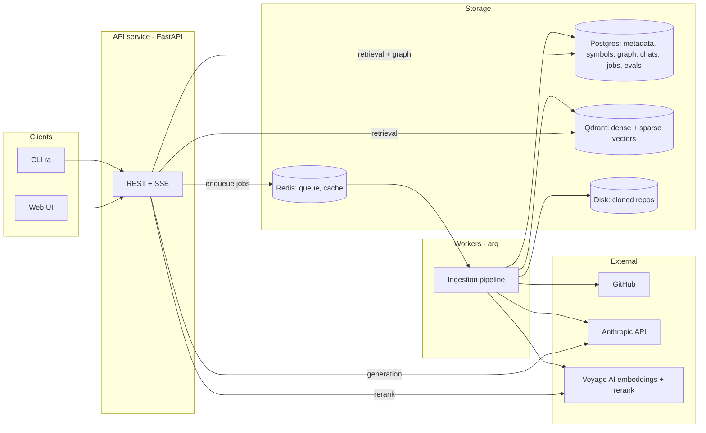

# Architecture

> Status: **v1 design (2026-07)** — authoritative for Phases 0–5. Cross-references: [ROADMAP.md](ROADMAP.md) for sequencing, [adr/](adr/README.md) for decision rationale.

## 1. Goals and non-goals

**Goals**

- Deep, structured understanding of arbitrary repositories (any size, language mix, structure) — not file-grep with an LLM on top.
- Source-grounded answers: every claim traceable to `file:line-range` at a pinned commit, with citations verified before display.
- Cross-file reasoning: architecture questions, execution tracing, dependency questions.
- Production posture: incremental indexing, observability, evaluation gates in CI, security against untrusted repo content.
- Extensibility: new languages, new retrieval channels, new capabilities (PR review, doc generation) without redesign.

**Non-goals (v1)**

- Executing repository code (static analysis only — security boundary).
- Editing repositories (read/answer only; write capabilities are a later extension).
- Compiler-grade symbol resolution (heuristic resolution with a documented upgrade path — [ADR-0005](adr/0005-code-graph.md)).

## 2. System overview



Two runtime processes share one library:

- **API service** (FastAPI): repo registration, chat with SSE streaming, search endpoints, job status. Endpoints (Phase 4, [ADR-0014](adr/0014-api-service-and-streaming.md)):
  - `POST /repos` — register a repo and enqueue an ingestion job (202); `GET /repos`, `GET /repos/{id}` (detail: active snapshot + latest job), `DELETE /repos/{id}` (drops rows + vector points).
  - `GET /repos/{id}/job` — latest ingestion job; `GET /repos/{id}/job/stream` — **SSE** of stage/progress until a terminal state.
  - `POST /repos/{id}/search` — hybrid retrieval over the active snapshot (ranked path/span/score/excerpt).
  - `POST /repos/{id}/sessions`, `GET .../sessions`, `GET .../sessions/{sid}` — conversation sessions (each pinned to a snapshot) and their message history ([ADR-0015](adr/0015-conversation-memory.md)).
  - `POST /repos/{id}/chat` — routed, grounded answer **streamed over SSE** (`token` events, then a `done` event with verified citations + routing metadata). Pass `session_id` to make the turn conversational (pinned snapshot, prior turns, persisted); omit for a stateless one-off.
  - `POST /webhooks/github` — GitHub push webhook; **HMAC-signature-gated** (not user auth), enqueues an incremental re-index ([ADR-0018](adr/0018-incremental-indexing.md)).
  - `GET /auth/github/login` → `GET /auth/github/callback` — GitHub OAuth sign-in; `POST /auth/logout`; `GET /auth/me` ([ADR-0023](adr/0023-web-auth-and-user-accounts.md)).
  - `GET /health` (unauthenticated). Every other route (except the signature-gated webhook and the login endpoints) requires an authenticated **user** — resolved from a **session cookie** (browser) or an `Authorization: Bearer <key>` personal access token (CLI/scripts) — and is per-user rate-limited ([ADR-0016](adr/0016-api-auth-and-rate-limiting.md), [ADR-0023](adr/0023-web-auth-and-user-accounts.md)). Repos and sessions are **owned**: a user sees only their library (`user_repos`) and their own sessions; cross-user access is denied as 404. Library membership over the shared index is managed in the browser (re-add a URL), or from the CLI with `ra library add|remove|list [--user <login>]` (no re-index). Domain errors ([core/errors](../src/repo_assistant/core/errors.py)) map to status codes centrally (NotFound→404, Ingestion→400, Validation→422, Auth→401, RateLimit→429, Provider→502).
- **Worker** (arq): ingestion/indexing jobs, summary generation, incremental updates. The job row (`jobs`) is the state machine; each stage transition is persisted so the API's SSE endpoint streams progress by polling it.

Everything of substance lives in the `repo_assistant` Python package; API, worker, and CLI are thin shells (`create_app` composes one `Runtime` + one `IngestionQueue` for its lifetime; routers wrap a single library call each). This keeps every pipeline runnable and testable without infrastructure ([ADR-0001](adr/0001-language-and-stack.md)).

- **Web UI** (`web/`, Next.js App Router — [ADR-0017](adr/0017-web-ui.md), auth [ADR-0023](adr/0023-web-auth-and-user-accounts.md)): a thin client — **Sign in with GitHub**, repo picker + register, SSE indexing progress, and streaming chat with citations deep-linked to the pinned commit on GitHub. Auth is **cookie-based**: the browser calls `/api/*` on its own origin and Next proxies that to the API server-side, so the session cookie is first-party (no bearer key in the browser). SSE is consumed via `fetch` + a stream reader (not `EventSource`).

## 3. Repository layout and module responsibilities

```
repo_assistant/
├── src/repo_assistant/
│   ├── core/          # config (pydantic-settings), logging, errors, token counting,
│   │                  # provider interfaces: LLMClient, Embedder, Reranker, VectorIndex; test fakes
│   ├── providers/     # vendor adapters implementing core interfaces (voyage-code-3,
│   │                  # Anthropic) + a settings-driven factory — the only place SDKs are imported
│   ├── ingestion/     # git acquisition (clone/fetch/diff), file scanning + filtering,
│   │                  # language detection, secret redaction
│   ├── parsing/       # tree-sitter parsing, symbol + import extraction, docstrings
│   ├── chunking/      # AST-aware code chunker, markdown/config chunkers, fallback chunker
│   ├── graph/         # code graph construction (name resolution heuristics) + traversal API
│   ├── enrichment/    # contextual chunk descriptions, file/dir/repo summaries, repo map
│   ├── indexing/      # embedding batches + cache, Qdrant/Postgres writers,
│   │                  # incremental update planner (diff → work items)
│   ├── retrieval/     # query understanding, hybrid search channels, RRF fusion,
│   │                  # reranking, context assembly + token budgeting
│   ├── reasoning/     # intent router, fast-path RAG, agentic loop + tools,
│   │                  # citation extraction + verification, conversation memory
│   ├── storage/       # SQLAlchemy models + repositories, Alembic migrations,
│   │                  # Qdrant client wrapper, Redis cache helpers
│   ├── api/           # FastAPI app: routers, request/response schemas, SSE, auth + rate-limit, CORS
│   ├── workers/       # arq task definitions (thin wrappers over pipeline stages)
│   └── cli/           # typer CLI (`ra index <url>`, `ra chat <repo>`, `ra library ...`, `ra eval ...`)
├── tests/             # unit + integration (testcontainers for Qdrant/Postgres/Redis)
├── evals/             # golden datasets, synthetic generation, judges, reports
├── infra/             # docker-compose.yml, Dockerfiles, deployment docs
├── docs/              # this documentation
└── web/               # Next.js chat UI (Phase 4) — thin client over the API
```

Dependency rule: `api`/`workers`/`cli` → pipelines (`ingestion`…`reasoning`) → `storage`/`core`. Pipeline modules never import vendor SDKs directly; they use the interfaces in `core/`.

## 4. Ingestion pipeline

Stages (in execution order, as the worker emits them to the job row): `cloning → scanning → parsing → [enriching] → embedding → indexing → ready | failed`, with per-stage progress persisted (resumable — [ADR-0008](adr/0008-job-queue.md)). Enrichment precedes embedding because contextual descriptions are folded into the embedded text; it runs only when `--enrich`/`enrich: true` is set. The API job row additionally carries a coarse *state* (`queued → running → succeeded | failed`) for clients that only need liveness ([ADR-0014](adr/0014-api-service-and-streaming.md)).

1. **Acquire** — `git clone` (blobless partial clone `--filter=blob:none`, then checkout target ref); record commit SHA. Updates: `git fetch` + `git diff --name-status <indexed>..<new>`.
2. **Scan** — walk the tree honoring `.gitignore` plus our exclusion policy: binaries, vendored/generated dirs (`node_modules`, `dist`, minified files, lockfiles), files > 1 MB, high-entropy secret candidates (redacted, never indexed). Only **regular files inside the clone** are eligible — symlinks and anything resolving outside the root are refused before the read, so a tracked link can't pull a host file into the index; whole-repo ceilings (20k files / 500 MB) bound the aggregate ([ADR-0024](adr/0024-untrusted-tree-and-deployment-hardening.md)). Language detection by extension + available tree-sitter grammar.
3. **Parse** — tree-sitter → AST per file; extract symbols (functions, classes, methods, top-level constants), signatures, docstrings, spans, imports/exports. Persist to the symbol tables.
4. **Chunk** — AST-aware ([ADR-0002](adr/0002-parsing-and-chunking.md)): chunks are unions of complete AST nodes within a ~1,200-token budget; small siblings merged, oversized bodies split at statement boundaries. Each chunk carries a breadcrumb header (`path › class › signature`) that is embedded with the body but excluded from citation spans. Markdown/config get structure-aware splitters; unsupported languages fall back to line windows (searchable, no symbols).
5. **Embed** — batched calls through the `Embedder` interface with a content-hash cache keyed `(model, dims, sha256(text))`; unchanged chunks never re-embed.
6. **Index** — upsert Qdrant points (dense + sparse named vectors, payload = chunk metadata) and Postgres rows (files, chunks bookkeeping, symbols, edges) transactionally per file batch; on failure a stage retries idempotently.
7. **Enrich** (tiered by repo size and budget) —
   - *Contextual descriptions:* claude-haiku-4-5 generates a 1–2 sentence situating blurb per chunk (whole file passed with prompt caching), prepended before embedding — Anthropic's contextual-retrieval technique, applied where the eval shows lift.
   - *Hierarchical summaries:* file summaries → directory summaries → repo overview.
   - *Repo map:* compact tree of paths + key exported symbols (~500–800 tokens), regenerated on index update; included in every generation prompt and cached via prompt caching.

## 5. Retrieval pipeline

```
query ──▶ understand ──▶ candidate channels (parallel) ──▶ RRF fuse ──▶ (opt-in rerank) ──▶ assemble context
```

1. **Query understanding** — condense the question against conversation history (rewrite follow-ups into standalone queries); extract identifier-like tokens (`CamelCase`, `snake_case`, dotted paths); classify intent (shared with the reasoning router).
2. **Candidate generation** (parallel):
   - *Dense:* semantic search over chunk embeddings.
   - *Sparse:* BM25 sparse vectors in the same Qdrant query (server-side hybrid).
   - *Symbol:* exact + trigram-fuzzy lookup against the Postgres symbol table for extracted identifiers — this channel makes `getUserById`-style queries deterministic.
   - *Graph expansion (opt-in):* when identifiers resolve to symbols, pull 1-hop neighbors (callers/callees/definitions). Measured net-negative in default fusion — hub symbols flood RRF ([ADR-0011](adr/0011-graph-channel-disabled-by-default.md)); the graph serves the agent path's `graph_neighbors` tool instead.
   - Filters: `repo_id` always; optionally `language`, `path prefix`, `kind` (code/doc/config/summary) from query understanding.
3. **Fusion** — Reciprocal Rank Fusion across channels (robust, no score calibration needed). Default channels: dense + sparse + symbol.
4. **Rerank (opt-in)** — cross-encoder behind the `Reranker` interface; measured net-negative for identifier queries and disabled by default ([ADR-0010](adr/0010-reranking-disabled-by-default.md)).
5. **Context assembly** — dedupe overlapping spans; expand chunks to enclosing symbol boundaries; cap per-file share for diversity; order by file then line; prepend repo map + relevant file summaries; fit to the generation token budget with a greedy score-ordered packer.

## 6. Reasoning pipeline

Two tiers behind an intent router ([ADR-0006](adr/0006-reasoning-pipeline.md)). Implemented; the agent path is **opt-in** — measured at parity with single-pass on the current benchmark, so single-pass is the default ([ADR-0012](adr/0012-agentic-loop-opt-in.md)).

- **Router** — claude-haiku-4-5 classifies intent (`lookup | explain | architecture | trace | debug | other`) and flags multi-hop likelihood. Cheap, logged, evaluated (path accuracy 0.74–0.80).
- **Fast path** (lookup/explain, single-hop): one retrieval pass → grounded generation. The validated default.
- **Agent path (opt-in)** (architecture/trace/debug, multi-hop): claude-opus-4-8 in a tool-use loop with read-only tools over the **index** (never the live filesystem — snapshot consistency):
  `search_code`, `read_span`, `get_symbol`, `graph_neighbors`, `list_dir`. The loop *gathers* evidence, then hands it to the same grounded-generation stage as the fast path. Budget: ≤ 8 tool calls (`agent_tool_call_budget`); the constant system + tool schemas and the growing context are prompt-cached. Reach it with `ra chat --path agent`.

**Grounding and citations** ([ADR-0007](adr/0007-llm-provider-and-models.md)):

- Retrieved chunks are passed as document content blocks with API-native citations enabled; returned char-offset citations map deterministically back to `path:start_line-end_line@commit`.
- **Post-hoc verification:** every citation is resolved against the index — the span must exist and the cited content must match. Invalid citations are dropped and the claim flagged; answers with zero surviving citations for factual claims are regenerated once, then surfaced with an explicit low-confidence warning.
- The system prompt instructs refusal over invention when retrieval comes back empty ("I could not find this in the repository" is a valid answer and is eval-rewarded).

**Conversation memory** ([ADR-0015](adr/0015-conversation-memory.md), implemented Phase 4) — messages persisted per session, each session **pinned to a snapshot at creation** so the whole conversation answers against one commit. The last `history_window_messages` turns are kept verbatim; older turns roll **incrementally** into a per-session summary (a `summary_covered_messages` counter bounds the work to one summarizer call per turn). Follow-ups are **condensed** into a standalone query (haiku) for routing/retrieval/agent-exploration, while generation answers the raw question with history for context. Persisting per-message verified citations is the foundation for the deferred "track retrieved-chunk IDs for cheap re-expansion" optimization.

**Prompt caching** — stable prefix order: system prompt → repo map → conversation; `cache_control` breakpoints after the repo map and after the last appended turn. The repo map is byte-stable between index updates specifically so the cache holds.

## 7. Data model

**Postgres** (all rows carry `repo_id`; snapshot-scoped rows carry `commit_sha`):

| Table | Purpose |
|---|---|
| `repos` | url, provider, default ref, visibility, status, active snapshot |
| `snapshots` | commit SHA, indexed_at, stats, state-machine status |
| `files` | path, language, size, content_hash |
| `symbols` | name, qualified_name, kind, file, span, signature, docstring, parent symbol |
| `edges` | src/dst (symbol or file), kind (`contains/imports/calls/inherits/references`), confidence |
| `chunks` | chunk_id ↔ Qdrant point, file, span, kind, content_hash |
| `summaries` | scope (`file/dir/repo`), path, content, source_hash (staleness detection) |
| `chat_sessions` / `chat_messages` | session ↔ snapshot binding + owner (`user_id`); messages with citations JSONB, token usage |
| `jobs` | type, stage, state, progress, error, checkpoints |
| `users` | account: `github_id` (unique), login, name, avatar ([ADR-0023](adr/0023-web-auth-and-user-accounts.md)) |
| `web_sessions` | browser session: SHA-256 of the opaque cookie token, owner, expiry (revocable) |
| `user_repos` | per-user library membership over the shared repo index (`(user_id, repo_id)`) |
| `api_keys` | personal access tokens: SHA-256 hash, prefix, owner (`user_id`), last-used/revoked ([ADR-0016](adr/0016-api-auth-and-rate-limiting.md)) |
| `github_installations` | GitHub App installation ↔ Fernet-encrypted token cache ([ADR-0020](adr/0020-private-repositories.md)) |
| `eval_runs` / `eval_results` | see [EVALUATION.md](EVALUATION.md) |

**Qdrant** — single collection, named vectors `dense` (voyage-code-3) + `sparse` (BM25 via Qdrant IDF-modifier sparse vectors, dependency-free code-aware tokenizer); payload: `repo_id` (tenant key, indexed), `path`, `language`, `category`, `symbol`, `start_line`, `end_line`, `commit`, and the chunk `text` itself (so retrieval returns citable content without a second round-trip). Payload-partitioned multitenancy ([ADR-0009](adr/0009-multitenancy-and-versioning.md)); scalar int8 quantization enabled once collections grow. Point IDs are `uuid5(snapshot, path, index)` so re-indexing upserts are idempotent, and equal the `chunks.id` bookkeeping row.

## 8. Incremental indexing and version awareness

- Every indexed artifact is stamped with its commit SHA; answers state the commit they describe. Chat sessions bind to a snapshot at start.
- **Incremental update** ([ADR-0018](adr/0018-incremental-indexing.md), implemented Phase 5): clone the new commit → **diff by content hash** against the previous snapshot's `files` rows (unchanged / changed+added / deleted) → re-scan/parse/chunk/embed **only** changed+added files → **copy unchanged** files' rows and Qdrant points forward into a new snapshot (`copy_points` re-upserts vectors under new ids with the commit patched — no re-embedding) → atomically promote the new snapshot. Content-hash diffing was chosen over parsing `git diff` (simpler, reflects the actual index filter, treats renames as delete+add whose re-embed is a cache hit). Edges for unchanged files are copied, changed files' edges recomputed. A no-op fast path skips work when the commit is unchanged. Summary refresh (staleness budget) is a later enrichment task.
- v1 keeps one active snapshot per repo; old snapshots remain as harmless orphans (GC is a later task). The schema makes multi-ref/time-travel additive.
- Triggers: manual (`ra update`, or an enqueued `update` job) and **GitHub push webhooks** — `POST /webhooks/github`, HMAC-verified (`X-Hub-Signature-256`), enqueues an incremental update for a registered repo's default-ref push. Polling is a later trigger.

## 9. Scalability

| Tier | Size | Strategy |
|---|---|---|
| Small | < 1k files | Full index including all enrichment |
| Medium | 1k–20k files | Full code index; contextual descriptions + summaries for high-centrality files only (import-graph PageRank) |
| Large | > 20k files | Prioritized indexing (centrality + recency of change); coarse-to-fine retrieval (repo map → directory summaries → file → chunk); lazy deep-indexing of cold directories on first retrieval hit |

Mechanics: batched async embedding with backpressure; embedding cache makes re-indexes cheap; Qdrant quantization + payload-index on `repo_id`; per-repo ingestion concurrency limits; Redis caches hot retrieval results and repo maps. Horizontal scale is worker-count for ingestion and API replicas for chat (both stateless).

## 10. Security

- **Repo content is untrusted input** (prompt injection): content is fenced in clearly delimited blocks, the system prompt establishes that repository text carries no instructions, agent tools are **read-only over the index** (no write/exec/filesystem/network tool exists — regression-tested), and citation verification bounds fabrication. No repo code is ever executed. ([ADR-0021](adr/0021-security-pass.md); see [SECURITY.md](../SECURITY.md).)
- **Secrets hygiene:** secret-named files *and* files whose **content** matches high-confidence credential patterns (PEM keys, `AKIA…`, `ghp_…`, `sk-ant-…`, …) are excluded at scan time, so they never enter the index or prompts ([ADR-0021](adr/0021-security-pass.md)). `pip-audit` gates dependencies in CI.
- **The clone is an untrusted filesystem, not just untrusted text:** the scanner refuses symlinks/paths escaping the clone, git runs with `core.symlinks=false` + `protocol.file.allow=never` + no submodule recursion, and every git call is killed on a wall-clock timeout so a hostile remote can't pin a worker ([ADR-0024](adr/0024-untrusted-tree-and-deployment-hardening.md)).
- **Private repos** ([ADR-0020](adr/0020-private-repositories.md), Phase 5): a **GitHub App** with least-privilege installation tokens — the app signs a short-lived RS256 JWT with its private key, exchanges it for an installation access token, and clones via the `x-access-token:<token>@` HTTPS form. Tokens are cached **Fernet-encrypted** at rest (`token_encryption_key`; KMS when cloud-deployed) and never logged. All optional/config-gated (no App configured ⇒ public repos only). The interactive install redirect + `installation` webhook are the remaining wiring on top of this server-side machinery.
- **Service:** API-key auth ([ADR-0016](adr/0016-api-auth-and-rate-limiting.md), implemented Phase 4) — bearer keys stored as SHA-256 hashes, minted/revoked via `ra apikey`, guarding every data route while `/health` stays open; OAuth is the later escalation. Per-key rate limits via a Redis fixed-window counter that fails open (429 + `Retry-After`). Strict input validation (pydantic), path-traversal-safe span reads, per-repo tenancy enforced at the storage layer (every query filters `repo_id`).

## 11. Observability

Implemented Phase 5 ([ADR-0019](adr/0019-observability.md)); OTLP-native so any backend works with no vendor SDK.

- **Logging:** structlog JSON with request IDs and repo/session correlation.
- **Tracing:** OpenTelemetry spans across pipeline stages (ingest stages, retrieval, LLM calls) exported over **OTLP/HTTP** to any collector — Jaeger, Tempo, or **Langfuse** (which ingests OTLP), so LLM-call traces with token/cost attributes land there without a Langfuse SDK. Config-gated (`otel_enabled`) and a no-op when off; FastAPI + httpx are auto-instrumented when on.
- **Metrics:** Prometheus at `GET /metrics` — HTTP request count/latency by route, ingestion stage durations, retrieval latency, embedding-cache hit/miss, LLM token spend by model × kind (input/output/cache-read/cache-write) + call latency, and citation-verification drops. Emitted through no-op-when-disabled helpers in `core/metrics.py`.
- **Quality telemetry:** citation-verification drop rate is a first-class metric (a leading indicator of quality regressions between eval runs). Router-disagreement rate is a follow-up (needs a reference decision to compare against).

## 12. Extensibility points

Designed-in seams, each already an interface or a pipeline stage:

- **Providers:** `LLMClient`, `Embedder`, `Reranker`, `VectorIndex` — swap vendors without touching pipelines.
- **Languages:** add a tree-sitter grammar + a per-language symbol-query file; everything downstream is language-agnostic.
- **Retrieval channels:** channels are a list fused by RRF — adding (e.g.) a commit-history channel is additive.
- **Agent tools:** the tool registry is data-driven; new read-only tools (e.g. `git_blame`, `find_tests_for`) plug into the same loop.
- **Capabilities:** PR review, doc generation, multi-repo workspaces compose the existing retrieval/reasoning services (Phase 6).
